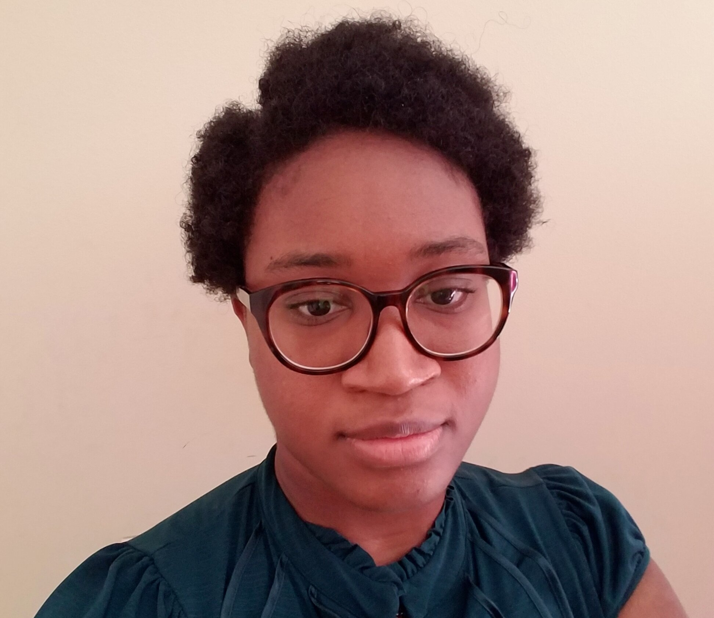
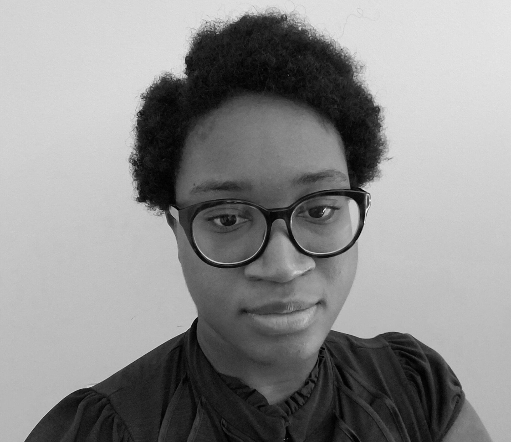

 
 

For Homework 1, I created two algorithms to the greyscale image and blurred image. For the greyscale image, I calculated the sum of the product of 3D matrix of image values and the 3D matrix containing the following numbers: 0.07, 0.72, 0.21. 
Then, the output matrix is converted to absolute values of the elements.
For the blurred image, I ran the image though a box filter, with the box kernel being set to a 19 x 19 array with 1/19 value in each element of the array.
